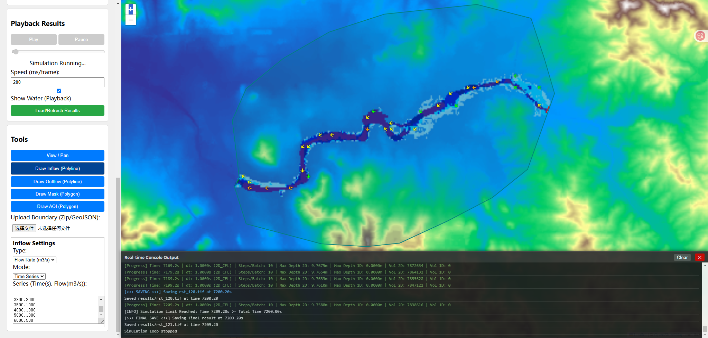

# 2D Hydrodynamic Model (Web-Based High Performance)

This project implements a high-performance **Coupled 1D-2D Hydrodynamic Model** using a **Hybrid C++/Python/Web Architecture**.
The 1D-2D coupled model still has certain shortcomings: it only supports single-reach calculation and does not yet support multi-reach calculation.
[]([https://github.com](https://github.com/BBC-9527/2DHydrodynamicModel))

## Architecture
- **Core Engine (C++)**: Solves the physics using Finite Volume Method (FVM) and HLL Flux scheme. High performance.
- **Web Interface**: Browser-based interactive GUI for drawing river networks, defining boundaries, and visualizing results in real-time.
- **Orchestration (Python)**: Handles data loading (GeoTIFF), 1D-2D coupling logic, and server-side processing.

## Prerequisites
- Python 3.10+
- Libraries: `numpy`, `rasterio`, `flask`, `scipy`
- C++ Compiler: MSVC (`cl.exe`) or compatible (for rebuilding DLLs).

## Project Structure
- `src/`: C++ Source code (`swe_core.cpp`, `swe_coupling.cpp`).
- `web/`: Web Application (`server.py`, `static/`).
- `swe_1d.py`: 1D Saint-Venant Equation solver.
- `swe_1d_network.py`: Network topology manager for 1D rivers.
- `build.bat`: Compilation script for Windows.

## How to Run

1.  **Compile the Core (Optional if DLLs exist)**:
    Double-click `build.bat` or run in terminal:
    ```cmd
    .\build.bat
    ```
    (Ensure `swe_core.dll` and `swe_coupling.dll` are created).

2.  **Run the Web Server**:
    ```cmd
    python web/server.py
    ```
    or use the helper script:
    ```cmd
    .\run_server.bat
    ```

3.  **Access the GUI**:
    Open your browser and navigate to:
    `http://localhost:8000`

## Features
*   **2D Only Mode**: Fast GPU/CPU shallow water simulation for floodplains.
*   **Coupled 1D-2D Mode**: Integrated river network (1D) with floodplain (2D) interaction.
*   **Interactive Tools**: Draw Inflow/Outflow boundaries, 1D Channels, and Obstacles directly on the map.
*   **Robust Coupling**: Includes automatic overlap detection, geometry integrity checks, and "Ghost Water" prevention mechanisms.

## Documentation
*   [Functional Specification](功能说明书.md)
*   [Coupling Module Details](1D-2D%20水动力耦合模块（SWE%20Coupling）文档.md)
